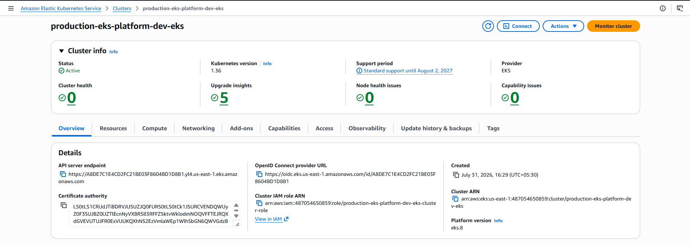
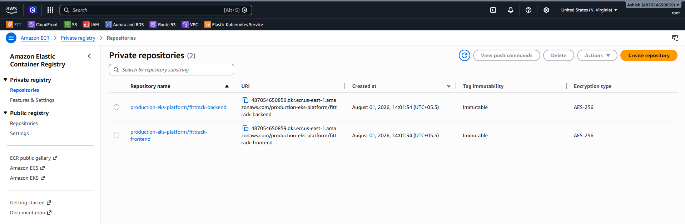
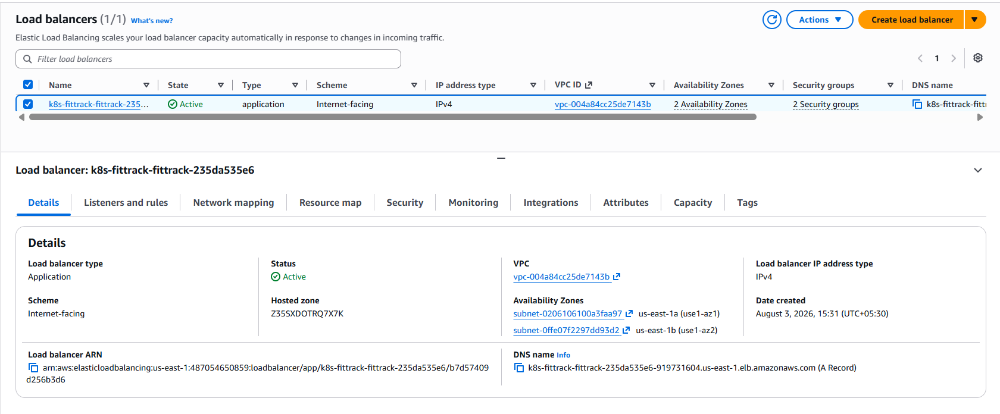
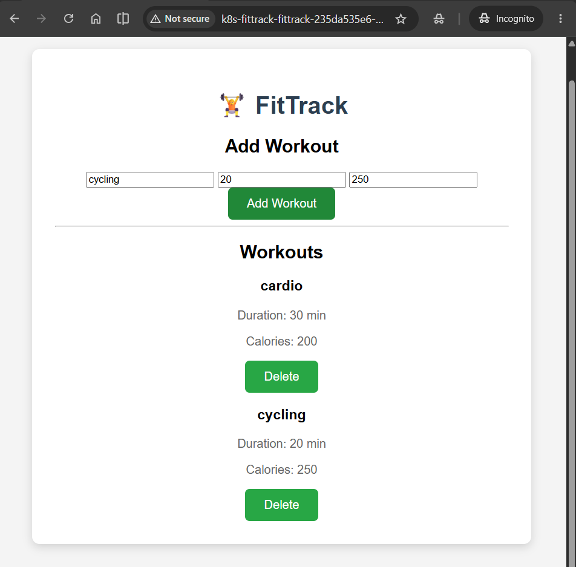
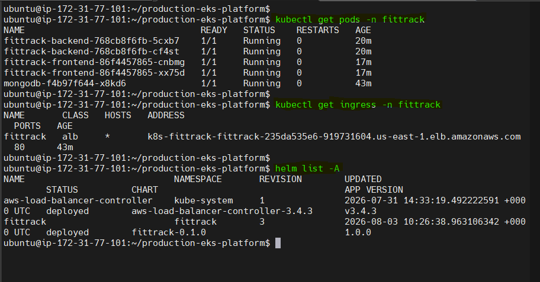
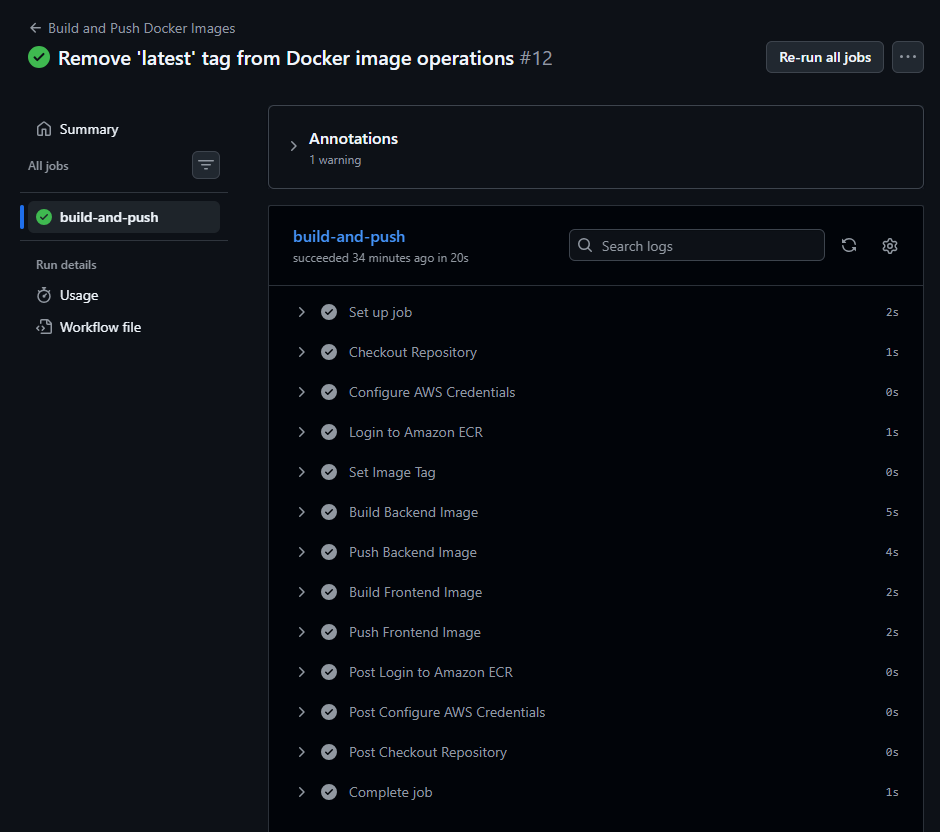

# 🚀 Production EKS Platform with FitTrack

A production-style DevOps project demonstrating the deployment of a containerized three-tier application on **Amazon EKS** using **Terraform**, **Helm**, **GitHub Actions**, and **Amazon ECR**.

The project provisions AWS infrastructure with Terraform, builds and publishes Docker images through GitHub Actions, and deploys the application to Kubernetes using Helm.

---

## 📌 Project Overview

This project demonstrates an end-to-end Kubernetes deployment workflow on AWS.

The FitTrack application consists of:

- Frontend (NGINX)
- Backend (Node.js & Express)
- MongoDB Database

Infrastructure is provisioned with Terraform, container images are stored in Amazon ECR, and deployments are managed with Helm on Amazon EKS.

---

# 🏗️ Architecture

```
                 GitHub
                    │
                    ▼
           GitHub Actions CI
                    │
                    ▼
          Build Docker Images
                    │
                    ▼
             Amazon ECR
                    │
                    ▼
                 Helm Chart
                    │
                    ▼
             Amazon EKS Cluster
                    │
        AWS Load Balancer (ALB)
             │              │
             ▼              ▼
      Frontend Pods     Backend Pods
                               │
                               ▼
                          MongoDB Pod
```

---

# 🛠️ Tech Stack

### Cloud
- AWS
- Amazon EKS
- Amazon ECR
- IAM
- VPC
- Application Load Balancer

### Infrastructure as Code
- Terraform

### Containerization
- Docker

### Orchestration
- Kubernetes
- Helm

### CI/CD
- GitHub Actions

### Application
- Node.js
- Express
- MongoDB
- NGINX

---

# ✨ Features

- Infrastructure provisioned using Terraform
- Kubernetes deployment using Helm
- CI pipeline with GitHub Actions
- Docker image storage in Amazon ECR
- Immutable image tagging using Git commit SHA
- ALB Ingress Controller integration
- Kubernetes ConfigMaps and Secrets
- Internal service discovery
- Three-tier application architecture

---

# 📷 Project Screenshots

## Amazon EKS Cluster



---

## Amazon ECR Repositories



---

## Application Load Balancer



---

## FitTrack Application



---

## Kubernetes Resources



---

## GitHub Actions CI



---

# 📁 Repository Structure

```
.
├── helm
├── terraform
├── docs
│   └── screenshots
├── scripts
└── README.md
```

---

# 🚀 Deployment Workflow

1. Provision AWS infrastructure using Terraform.
2. Build Docker images with GitHub Actions.
3. Push images to Amazon ECR.
4. Deploy application using Helm.
5. Expose application through AWS Application Load Balancer.

---

# 📚 Key Learnings

- Provisioning AWS infrastructure with Terraform
- Deploying Kubernetes clusters using Amazon EKS
- Building Helm charts from scratch
- Configuring Kubernetes ConfigMaps and Secrets
- Deploying applications using Helm
- Creating CI pipelines with GitHub Actions
- Using immutable image tags in Amazon ECR
- Debugging Kubernetes deployments and networking

---

# 🔮 Future Improvements

- GitOps with Argo CD
- Prometheus & Grafana Monitoring
- Horizontal Pod Autoscaling
- HTTPS with ACM
- External DNS
- Automated image updates

---

# 👤 Author

**Ashish Thakur**

GitHub: https://github.com/ashyT-Cloud
